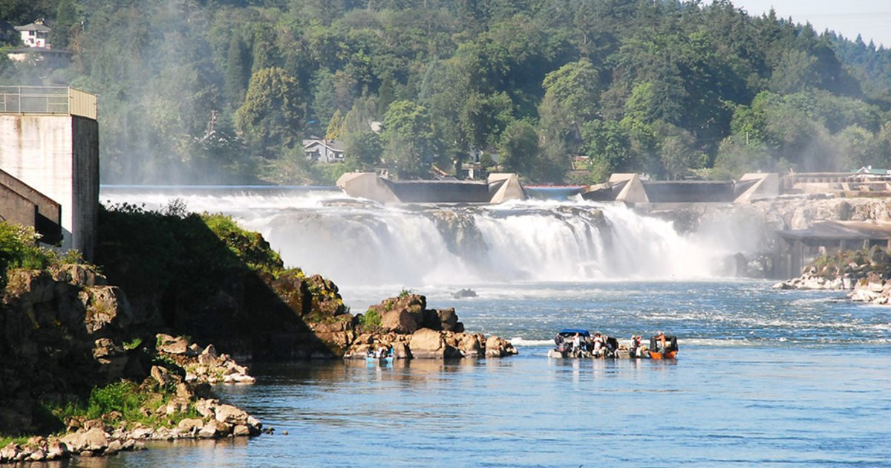
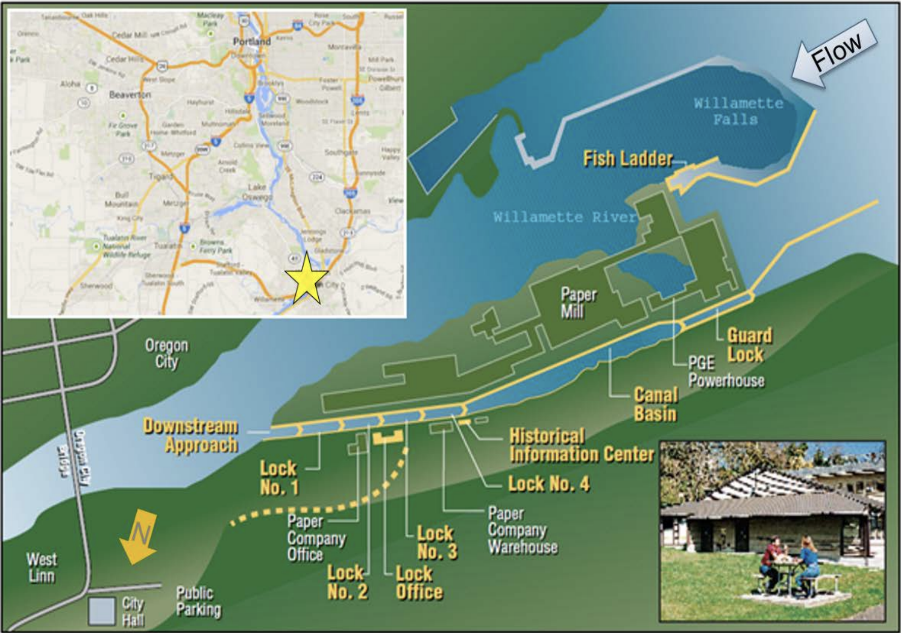

## Overview {.tabset .tabset-pills}

The following report examines....A brief summary (3 - 4 sentences) of the dataset, and what is included in this report


A map of the fish ladder location (you can make this in R on your own, or include an existing map appropriately licensed, with attribution)



A professionally formatted data citation

```{r setup, include=TRUE, message = FALSE, warning = FALSE}
knitr::opts_chunk$set(echo = TRUE)
# attach packages
library(tidyverse)
library(here)
library(lubridate)
library(tsibble)
library(feasts)
library(slider)
library(janitor)
library(patchwork)
library(gghighlight)
library(plotly)
library(paletteer)
library(RColorBrewer)

```

**Reading in the data**
```{r}
# reading in and preparing the data
fish <- read_csv(here("data", "willamette_fish_passage.csv")) %>% 
  clean_names() %>%
  mutate(date = lubridate::mdy(date)) %>% # turning the date into mdy format with lubridate 
  as_tsibble(key = NULL, index = date) %>% # changing the format to a tsibble for use in time series
  select(date, coho, jack_coho, steelhead) # selecting for fish species of interest

# changing all NA values to 0 
fish[is.na(fish)] <- 0 

# creating a longer df with single observations for each of the fish species of interest
fish_longer <- fish %>% 
  pivot_longer(cols = 2:4, names_to = "species", values_to = "count") %>% # selecting for fish species of interest
  mutate(species = case_when(
    species == "coho" ~ "Coho",
    species == "jack_coho" ~ "Jack Coho", 
    species == "steelhead" ~ "Steelhead"))

fish_month <- fish_longer %>% 
  index_by(month = ~yearmonth(.)) %>% 
  group_by(species) %>% 
  summarize(monthly_total = sum(count)) %>% 
  mutate(year = year(month))
```

### Tab 1: Original time series

-  A finalized, static graph of adult passage for coho, jack coho, and steelhead salmon (you decide if these all occupy the same panel, or if they are in separate panels). Add a figure caption. Replace NA values with zero. 
 -  2 - 3 bullet points summarizing major patterns / notable trends in the salmon passage time series data
 
```{r}
ggplot(data = fish_month, aes(x = month, 
                               y = monthly_total,
                               color = species)) +
  geom_line(size = 0.7) +
  theme_minimal(12) +
  theme(legend.position = c(.6, .75),
        legend.title = element_blank(),
        legend.text = element_text(
          size = 12),
        axis.text.x = element_text(
          vjust = 8)
        ) +
  scale_color_manual(values = c("firebrick3", "goldenrod3", "darkgreen")) +
  labs(x = element_blank(), y = "Total fish count per month") 


```
 
 
 We need to ask some big picture questions at this point, like: 

- Does there appear to be an overall trend? No.
- Does there appear to be seasonality? Yes.
- Does there appear to be cyclicality? Unsure.
- Any notable outliers or additional patterns? No noted.

### Tab 2: Seasonplots
-  A finalized seasonplot for each species (coho, jack coho, steelhead) in its own panel. You can either facet_wrap/facet_grid, or use patchwork or cowplot, to make the figure. Add a caption.

```{r}
# season plot for each fish species
fish_longer %>% 
  gg_season(y = count, pal = c("darkgreen", "goldenrod3", "firebrick3")) +
  theme_minimal(12) +
  labs(x = element_blank(), y = "Daily Count") +
  theme(axis.text.x = element_text(
    size = 12))
```

Add 2 - 3 bullet points summarizing the major trends you see in the seasonplots.

### Tab 3: Annual counts by species

```{r}
fish_annual <- fish_longer %>% 
  index_by(year = ~year(.)) %>% 
  group_by(species) %>% 
  summarize(yearly_counts = sum(count)) 

ggplot(data = fish_annual, aes(x = year, y = yearly_counts, color = species)) +
          geom_line(size = 1) +
  theme_minimal(12) +
  theme(legend.position = c(.6, .75),
        legend.title = element_blank(),
        legend.text = element_text(
          size = 12),
        axis.text.x = element_text(
          vjust = 8)
        ) +
  scale_color_manual(values = c("firebrick3", "goldenrod3", "darkgreen")) +
  labs(x = element_blank(), y = "Total fish count per month") +
  scale_x_discrete(breaks = 10)
  
  
```

-  A finalized figure of annual totals for fish passage, for each of the 3 species (coho, jack coho, steelhead). You decide if this is in a single panel, or multiple panels. Add a figure caption. 
-  Add 2 - 3 bullet points summarizing major trends you see in the annual totals by species from 2000 - 2010.


